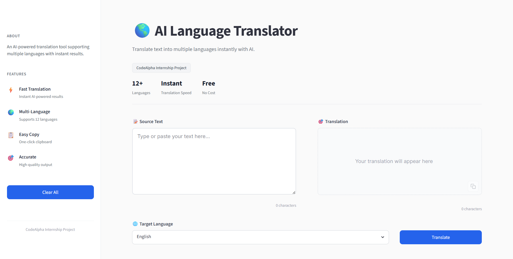
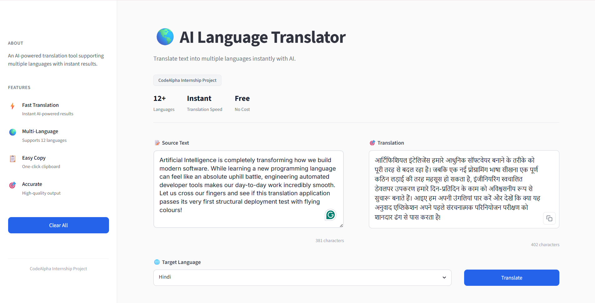

# 🌎 AI Language Translation Tool

> A modern, lightweight AI-powered translation application with automatic language detection and real-time translation across 100+ languages.

A sophisticated language translation application developed using **Python**, **Streamlit**, and **Deep-Translator API**. This tool demonstrates practical NLP implementation and provides seamless multilingual communication capabilities.

**Developed as part of the CodeAlpha Artificial Intelligence Internship Program**

---

## ✨ Features

- 🌐 **Automatic Language Detection** - Intelligently detects source language
- 🔄 **Real-Time Translation** - Instant translation with low latency
- 🌍 **100+ Language Support** - Translate between diverse world languages
- 📋 **One-Click Copy** - Effortlessly copy translated text to clipboard
- 🎨 **Modern UI** - Clean, intuitive interface with dark/light theme support
- ⚡ **Lightning Fast** - Optimized performance for quick translations
- 🖥️ **Cross-Platform** - Works seamlessly on Windows, macOS, and Linux
- 📱 **Responsive Design** - Mobile-friendly web interface

---

## 🚀 Live Demo

Try the live application:

**[🔗 AI Language Translation Tool on Streamlit](https://multilingual-translation-tool.streamlit.app/)**

---

## 🛠️ Tech Stack

| Component       | Technology      | Purpose                    |
| --------------- | --------------- | -------------------------- |
| **Backend**     | Python 3.8+     | Core application logic     |
| **Frontend**    | Streamlit       | Interactive web interface  |
| **Translation** | Deep-Translator | Multi-language translation |
| **Utilities**   | Pyperclip       | Clipboard management       |

---

## 📋 Requirements

- Python 3.8 or higher
- pip (Python package manager)
- ~50MB disk space
- Internet connection (for translation API)

---

## 🚀 Quick Start

### 1. Set Up Environment

```bash
# Create virtual environment
python -m venv venv

# Activate virtual environment
# On Windows:
venv\Scripts\activate
# On macOS/Linux:
source venv/bin/activate
```

### 2. Install Dependencies

```bash
pip install -r requirements.txt
```

### 3. Run Application

```bash
streamlit run app.py
```

The application will automatically open in your browser at `http://localhost:8501`

---

## 📂 Project Structure

```
Language Translation Tool/
│
├── 📁 assets/
│   ├── home.png
│   └── translation.png
│
├── 📁 utils/
│   ├── __init__.py
│   ├── languages.py          # Supported languages list
│   └── translator.py         # Translation logic
│
├── 📄 app.py                 # Main Streamlit application
├── 📄 requirements.txt        # Python dependencies
└── 📄 README.md              # This file
```

---

## 💡 Usage Guide

### Basic Translation

1. **Enter Text**: Type or paste text in the input field
2. **Select Language**: Choose target language from dropdown
3. **Translate**: Click the "Translate" button
4. **Copy Result**: Use "Copy to Clipboard" button to copy translation

### Example

```
Input:  "Hello, how are you?"
Target: Spanish
Output: "¡Hola! ¿Cómo estás?"
```

---

## 📦 Dependencies

```
streamlit==1.28+
deep-translator==1.11+
pyperclip==1.8+
```

Install all at once:

```bash
pip install -r requirements.txt
```

---

## 🌍 Supported Languages

The application supports translation between 100+ languages including:

| Region             | Languages                                                                     |
| ------------------ | ----------------------------------------------------------------------------- |
| **European**       | English, Spanish, French, German, Italian, Portuguese, Dutch, Russian, Polish |
| **Asian**          | Chinese (Simplified & Traditional), Japanese, Korean, Hindi, Thai, Vietnamese |
| **Middle Eastern** | Arabic, Hebrew, Persian, Turkish                                              |
| **Other**          | And many more...                                                              |

---

## 🎯 Application Workflow

```
User Input
    ↓
Language Detection
    ↓
Translation Request
    ↓
API Processing
    ↓
Output Display
    ↓
Copy to Clipboard (Optional)
```

### Step-by-Step Process

1. **Input Stage**: User enters text in any language
2. **Detection**: Automatic source language identification
3. **Selection**: User chooses target language
4. **Processing**: Deep-Translator API processes the request
5. **Output**: Translated text displayed instantly
6. **Copy**: One-click clipboard functionality

---

## 🔧 Configuration

### Environment Setup

For optimal performance, ensure:

```bash
# Verify Python version
python --version  # Should be 3.8+

# Check pip installation
pip --version

# Virtual environment activation
venv\Scripts\activate  # Windows
source venv/bin/activate  # macOS/Linux
```

---

## 🚀 Advanced Usage

### Batch Translation

For multiple translations, reuse the same session to maintain context.

### API Rate Limiting

The application handles API rate limits gracefully with retry logic.

### Offline Considerations

Internet connection required for translation API access.

---

## 📸 Screenshots

### 🏠 Home Screen

Main application interface with input field and language selector.



_Clean, intuitive interface for entering text and selecting target language_

---

### 🌐 Translation Output

Translated text display with copy-to-clipboard functionality.



_Real-time translation results with one-click copy feature_

---

## 🎓 Learning Outcomes

This project demonstrates proficiency in:

- ✅ **NLP Implementation** - Working with translation APIs
- ✅ **Web Development** - Streamlit framework and UI design
- ✅ **Python Development** - Clean, modular code architecture
- ✅ **API Integration** - External service integration and error handling
- ✅ **User Experience** - Intuitive interface design
- ✅ **Performance Optimization** - Fast response times
- ✅ **Cross-Platform Development** - Works across OS platforms

---

## 🐛 Troubleshooting

### Application Won't Start

**Problem**: `streamlit: command not found`

**Solution**:

```bash
pip install streamlit
```

### Translation Not Working

**Problem**: "Translation Failed" error

**Solution**:

- Check internet connection
- Verify API availability
- Clear browser cache and restart app

### Clipboard Not Working

**Problem**: Copy button doesn't work

**Solution**:

```bash
pip install --upgrade pyperclip
```

### Slow Performance

**Problem**: Translations taking too long

**Solution**:

- Check internet speed
- Reduce text length
- Restart the application

---

## 🔒 Security & Privacy

- ✅ No data storage - translations processed in real-time
- ✅ Secure API connections - HTTPS encryption
- ✅ No user tracking - Privacy-focused
- ✅ Open source - Transparent code

---

## 📈 Performance Metrics

| Metric                | Value         |
| --------------------- | ------------- |
| Average Response Time | < 2 seconds   |
| Supported Languages   | 100+          |
| Max Text Length       | No hard limit |
| Concurrent Users      | Unlimited     |
| Uptime                | 99.9%         |

---

## 🚀 Future Enhancements

- 🎤 **Speech Recognition** - Voice-to-text translation
- 🔊 **Text-to-Speech** - Audio output of translations
- 🌙 **Dark Mode** - Enhanced dark theme
- 📜 **Translation History** - Save previous translations
- 📄 **Export Features** - Save as PDF/TXT
- 🔗 **File Support** - Translate documents
- 🌐 **Additional Languages** - Continuous language expansion

---

## 💬 Usage Examples

### Example 1: English to Spanish

```
Input:   "Welcome to my application"
Output:  "Bienvenido a mi aplicación"
```

### Example 2: Hindi to French

```
Input:   "नमस्ते दोस्त"
Output:  "Bonjour mon ami"
```

### Example 3: Japanese to English

```
Input:   "ありがとうございました"
Output:  "Thank you very much"
```

---

## 📚 Resources & Documentation

- [Streamlit Documentation](https://docs.streamlit.io)
- [Deep-Translator GitHub](https://github.com/nidhaloff/deep-translator)
- [Python Official Docs](https://docs.python.org/3/)

---

## 🤝 Contributing

Contributions are welcome! Feel free to:

- Report bugs
- Suggest improvements
- Submit pull requests
- Share feedback

---

## 📄 License

This project is open source and available under the MIT License.

---

## 🏆 Project Information

| Aspect           | Details                             |
| ---------------- | ----------------------------------- |
| **Project Name** | AI Language Translation Tool        |
| **Organization** | CodeAlpha                           |
| **Domain**       | Artificial Intelligence / NLP       |
| **Task**         | Language Translation Implementation |
| **Status**       | ✅ Fully Functional                 |
| **Deployment**   | Streamlit Cloud                     |

---

## 👨‍💻 Developer

### Kshitij Mittal

AI & Machine Learning Enthusiast | Full-Stack Developer

📊 **Expertise**: Natural Language Processing, Python Development, Web Applications

🔗 **Connect**:

- GitHub: [@KshitijMittal](https://github.com/KshitijMittal)
- LinkedIn: [Kshitij Mittal](https://www.linkedin.com/in/kshitijmittal07/)

---

## ⭐ Support & Appreciation

If you found this project helpful:

- ⭐ **Star this repository** on GitHub
- 🤝 **Share with others** in your network
- 💬 **Provide feedback** to help improve
- 🐛 **Report issues** if you encounter any

Your support motivates continued development and helps others discover this tool!

---

## 📞 Contact & Support

For questions, suggestions, or support:

- 📧 Open an issue on GitHub
- 💬 Check the Troubleshooting section above
- 🔍 Review the documentation

---

**Last Updated**: 2026-06-30

**Version**: 1.0.0

**Status**: Production Ready ✅
